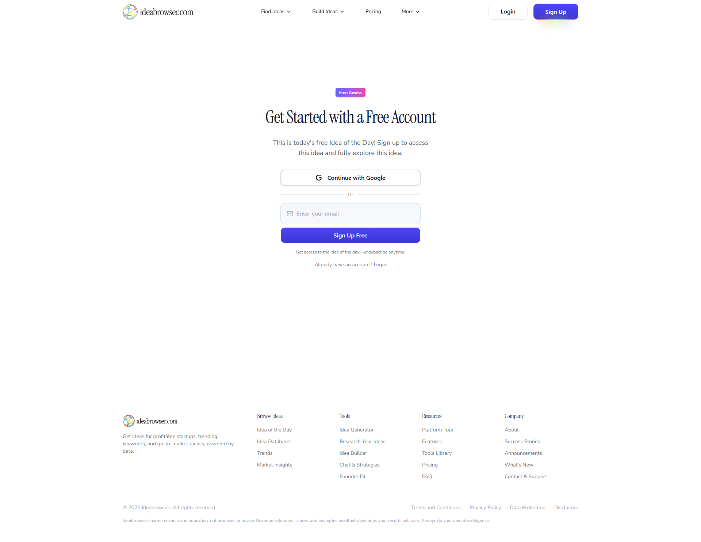

# Ideabrowser | #1 Software to Find Startup Ideas Worth Building

**URL:** https://www.ideabrowser.com/idea/1099-financial-wealth-building-infrastructure-for-independent-contractors/founder-fit

**Source Link:** 🧠Right for You?Best for fintech-savvy founders with gig economy insightsFind Out

**Description:** Get ideas for profitable startups, trending keywords, and go-to-market tactics, powered by data. Start seeing opportunity.

---

## Screenshot

---

## Get Started with a Free Account

## Content

Free Access

# Get Started with a Free Account

This is today's free Idea of the Day! Sign up to access this idea and fully explore this idea.

Continue with Google

Or

Sign Up Free

Get access to the idea of the day—unsubscribe anytime.

Already have an account?[Login](/login?redirectTo=%2Fidea%2F1099-financial-wealth-building-infrastructure-for-independent-contractors)

---

## Page Structure

- Get Started with a Free Account
    - Browse Ideas
    - Tools
    - Resources
    - Company

